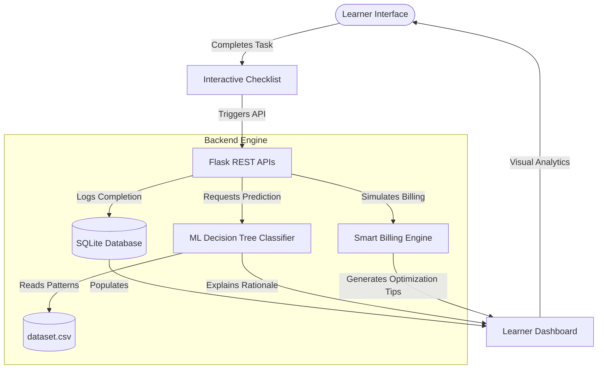

# Real-Time Cloud Provisioner for Resource-Based Learning

[](https://www.python.org/)
[](https://flask.palletsprojects.com/)
[](https://www.sqlite.org/)
[](https://scikit-learn.org/)
[](#)

An intelligent, cloud-learning management platform that replaces manual self-reporting with **automatic task-based evaluation** and **machine learning performance analysis**. It guides users through hands-on cloud labs (such as EC2, S3, Serverless, and Load Balancers) and evaluates their proficiency using an explainable ML decision model and a simulated cost billing engine.

---

## 🚀 Key Features

*   **⚡ Automatic Task-Based Evaluation**: Eliminates manual input errors. Scores are calculated objectively based on progress through interactive task checklists.
*   **📊 Explainable ML Skill Classifier**: Predicts user skill levels (`Beginner`, `Intermediate`, or `Advanced`) with confidence metrics using a Decision Tree model. Explains the prediction rationale and runs "What-If" scenarios.
*   **💳 Smart Billing & Cost Simulator**: Implements standard pricing models for cloud resources with custom attempt multipliers, encouraging efficiency and error reduction.
*   **🧠 Insights Manager & AI Coach**: Analyzes history to generate radar charts, timelines, performance summaries, and personalized training tips.
*   **🏆 Competency Leaderboard**: Promotes friendly competition and peer benchmarking based on average score, session count, and cost efficiency.
*   **🔑 Administrator Control Panel**: Full-featured administrative suite to manage users, monitor platform metrics, and audit system sessions.

---

## 🗺️ System Architecture



---

## 📁 Repository Structure

```
├── app.py                          # Flask application server, controllers, and APIs
├── db.py                           # Database schema and SQLite access functions
├── model.py                        # ML model training, prediction, and Explainable AI (XAI)
├── cloud_knowledge.py              # Knowledge engine, roadmap configurations, and error simulations
├── billing_engine.py               # Resource base costs, multiplier calculations, and billing summaries
├── insight_manager.py              # Statistical aggregations, AI coaching, and chart data formatting
├── dataset.csv                     # Historical training data for the ML classifier
├── templates/                      # Frontend templates (Jinja2)
│   ├── base.html                   # Global UI wrapper and navigation structure
│   ├── login.html                  # Authenticated portal gate (Login/Register)
│   ├── dashboard.html              # Performance analytics dashboard (Chart.js & AI Insights)
│   ├── learn.html                  # Interactive Cloud Labs checklist environment
│   ├── billing.html                # Resource billing details, calculators, and optimization tips
│   ├── profile.html                # User preferences, password management, and personal stats
│   ├── leaderboard.html            # Top performing learner rankings
│   └── admin.html                  # Admin tools (user deletion, stats inspect, query lists)
├── requirements.txt                # System packages file (Flask, scikit-learn, pandas)
└── docs/                           # Extended technical documentation
    ├── QUICK_START.md              # End-user checklist & usage instructions
    ├── TASK_BASED_TRACKING.md      # API definitions and backend architecture
    ├── TASK_BASED_IMPLEMENTATION.md# Step-by-step developer implementation guide
    ├── QUICK_REFERENCE.md          # Database functions and api endpoint reference
    ├── VIVA_GUIDE.md               # Viva presentation script and Q&A reference
    └── CHANGES_SUMMARY.md          # Technical changelog
```

---

## 🛠️ API Reference

| Endpoint | Method | Description |
| :--- | :--- | :--- |
| `/api/session/tasks/<session_id>` | `GET` | Retrieves all tasks for a session and their completion status |
| `/api/task/complete` | `POST` | Marks a specific task completed and increases internal attempts |
| `/api/session/progress/<session_id>`| `GET` | Computes progress percentages, scores, and active attempts |
| `/api/session/finalize` | `POST` | Calculates final metrics, queries ML model, and saves results |

---

## ⚙️ Getting Started

### 📋 Prerequisites
Ensure you have **Python 3.8+** installed on your local machine.

### 🔌 Installation & Setup

1. **Clone the repository**:
   ```bash
   git clone https://github.com/chubhi24/REAL-TIME-CLOUD-PROVISIONER-FOR-RESOURCE-BASED-LEARNING.git
   cd REAL-TIME-CLOUD-PROVISIONER-FOR-RESOURCE-BASED-LEARNING
   ```

2. **Activate the Virtual Environment**:
   * **macOS / Linux**:
     ```bash
     source .venv/bin/shift  # or source venv/bin/activate
     ```
   * **Windows**:
     ```cmd
     .venv\Scripts\activate
     ```

3. **Install Dependencies**:
   ```bash
   pip install -r requirements.txt
   ```

4. **Launch the Flask Application**:
   ```bash
   python app.py
   ```

The application will start in debug mode on **`http://127.0.0.1:5002`**.

---

## 💡 Usage Workflow

1. **Register or Login**: Start by registering a new account or sign-in with credentials (default admin credentials: `admin` / `admin123`).
2. **Select a Cloud Goal**: Navigate to the **Learning** tab and launch a target cloud objective (e.g., *Launch EC2 Instance*).
3. **Execute and Check**: Follow the instructions, checking off each task as you complete it. Your progress bar updates automatically.
4. **Finalize**: Click **"Complete Learning Session"**. The server tracks your time, scores your attempt, calls the ML model, and predicts your skill category.
5. **Inspect Performance**: Review performance summaries, cost graphs, and AI coaching insights inside the **Dashboard**.

---

## 🛡️ License
This project is licensed under the MIT License.
